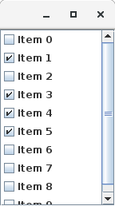

A JList Java component with checkable items.



```java 
/**
 * Very simple example that creates a list of checkable items. The user can check/uncheck the items
 * he wants. When the window is closed, the state of each item is printed on the standard output.
 *
 * @author Bart Jourquin
 */
 
import java.awt.Dimension;
import java.awt.event.WindowAdapter;
import java.awt.event.WindowEvent;

import javax.swing.DefaultCheckListModel;
import javax.swing.JCheckList;
import javax.swing.JFrame;
import javax.swing.JScrollPane;

public class Example {

  /** Constructor. */
  public Example() {
    JFrame frame = new JFrame();
    frame.setDefaultCloseOperation(JFrame.EXIT_ON_CLOSE);

    // Create a list containing CheckboxListItem's
    final DefaultCheckListModel<String> myModel = new DefaultCheckListModel<String>();
    JCheckList<String> myCheckList = new JCheckList<>(myModel);

    // Fill it
    for (int i = 0; i < 10; i++) {
      myModel.addItem("Item " + i);
    }

    // Just print the state of each item at closing time
    frame.addWindowListener(
        new WindowAdapter() {
          @Override
          public void windowClosing(WindowEvent e) {
            for (int i = 0; i < myModel.getSize(); i++) {
              if (myModel.isChecked(i)) {
                System.out.println("Item " + i + " is checked");
              } else {
                System.out.println("Item " + i + " is unchecked");
              }
            }
            e.getWindow().dispose();
          }
        });

    frame.getContentPane().add(new JScrollPane(myCheckList));
    frame.setSize(new Dimension(150, 250));
    frame.setVisible(true);
  }

  public static void main(String[] args) {
    new Example();
  }
}
```